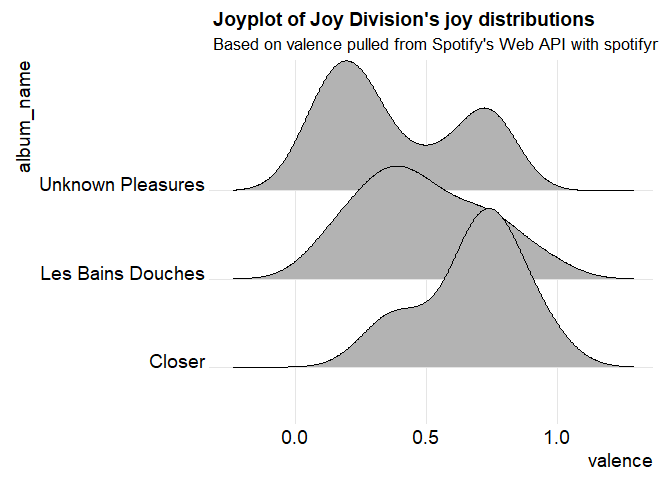

<!-- README.md is generated from README.Rmd. Please edit that file -->
Overview
--------

spotifyr is a quick and easy wrapper for pulling track audio features from Spotify's Web API in bulk. By automatically batching API requests, it allows you to enter an artist's name and retrieve their entire discography in seconds, along with Spotify's audio features and track/album popularity metrics. You can also pull song and playlist information for a given Spotify User (including yourself!).

Installation
------------

``` r
devtools::install_github('charlie86/spotifyr')
```

Authenication
-------------

You'll have to set up a Dev account with Spotify to access their Web API [here](https://developer.spotify.com/my-applications/#!/applications). This will give you your `Client ID` and `Client Secret`. Once you have those, you can pull your access token into R with `get_spotify_access_token`.

The easiest way to authenticate is to set your credentials to the System Environment variables `SPOTIFY_CLIENT_ID` and `SPOTIFY_CLIENT_SECRET`. The default arguments to `get_spotify_access_token` (and all other functions in this package) will refer to those. Alternatively, you can set them manually and make sure to explicitly refer to your access token in each subsequent function call.

``` r
Sys.setenv(SPOTIFY_CLIENT_ID = 'xxxxxxxxxxxxxxxxxxxxx')
Sys.setenv(SPOTIFY_CLIENT_SECRET = 'xxxxxxxxxxxxxxxxxxxxx')

access_token <- get_spotify_access_token(client_id = Sys.getenv('SPOTIFY_CLIENT_ID'), client_secret = Sys.getenv('SPOTIFY_CLIENT_SECRET'))
```

Usage
-----

### What was The Beatles' favorite key?

``` r
library(spotifyr)
```

``` r
beatles <- get_artist_audio_features('the beatles')

count(beatles, key_mode, sort = T)
#> # A tibble: 22 x 2
#>    key_mode     n
#>       <chr> <int>
#>  1  C major    40
#>  2  D major    38
#>  3  A major    33
#>  4  G major    33
#>  5  E major    20
#>  6  F major    13
#>  7  B minor     9
#>  8  A minor     8
#>  9 C# minor     8
#> 10 F# minor     8
#> # ... with 12 more rows
```

### What's the most danceable Joy Division song?

``` r
joy <- get_artist_audio_features('joy division')

joy %>% 
 arrange(-danceability) %>% 
 select(track_name, danceability) %>% 
 head(10)
#> # A tibble: 10 x 2
#>                                       track_name danceability
#>                                            <chr>        <dbl>
#>  1            Passover - 2007 Remastered Version        0.773
#>  2   A Means To An End - 2007 Remastered Version        0.655
#>  3      Heart And Soul - 2007 Remastered Version        0.640
#>  4             Insight - 2007 Remastered Version        0.636
#>  5              Colony - 2007 Remastered Version        0.600
#>  6           Candidate - 2007 Remastered Version        0.586
#>  7          Wilderness - 2007 Remastered Version        0.584
#>  8             Decades - 2007 Remastered Version        0.572
#>  9 Atrocity Exhibition - 2007 Remastered Version        0.565
#> 10           Isolation - 2007 Remastered Version        0.544
```

### Joyplot of the emotional rollercoasters that are Joy Division's albums

``` r
library(ggjoy)
#> Loading required package: ggplot2
#> Loading required package: ggridges
#> The ggjoy package has been deprecated. Please switch over to the
#> ggridges package, which provides the same functionality. Porting
#> guidelines can be found here:
#> https://github.com/clauswilke/ggjoy/blob/master/README.md

ggplot(joy, aes(x = valence, y = album_name)) + 
  geom_joy() + 
  theme_joy() +
  ggtitle("Joyplot of Joy Division's joy distributions", subtitle = paste0("Based on valence pulled from Spotify's Web API with spotifyr"))
#> Picking joint bandwidth of 0.113
```


