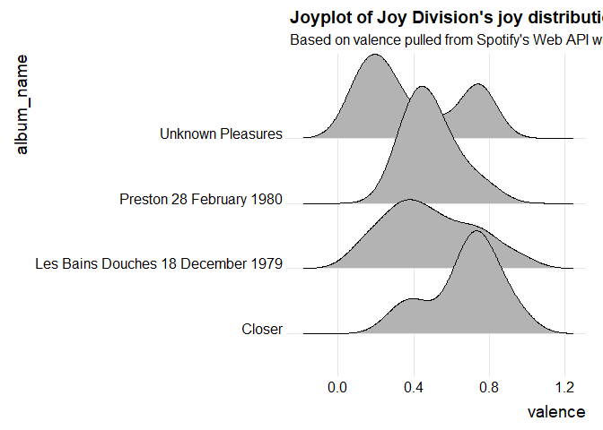

<!-- README.md is generated from README.Rmd. Please edit that file -->

# spotifyr

[](https://cran.r-project.org/package=spotifyr)


## Overview

spotifyr is a wrapper for pulling track audio features and other
information from Spotify’s Web API in bulk. By automatically batching
API requests, it allows you to enter an artist’s name and retrieve their
entire discography in seconds, along with Spotify’s audio features and
track/album popularity metrics. You can also pull song and playlist
information for a given Spotify User (including yourself\!).

## Installation

Development version (recommended)

``` r
devtools::install_github('charlie86/spotifyr')
```

CRAN version 1.0.0 (Note: this is somewhat outdated, as it takes extra
time to submit and pass CRAN checks)

``` r
install.packages('spotifyr')
```

## Authentication

First, set up a Dev account with Spotify to access their Web API
[here](https://developer.spotify.com/my-applications/#!/applications).
This will give you your `Client ID` and `Client Secret`. Once you have
those, you can pull your access token into R with
`get_spotify_access_token()`.

The easiest way to authenticate is to set your credentials to the System
Environment variables `SPOTIFY_CLIENT_ID` and `SPOTIFY_CLIENT_SECRET`.
The default arguments to `get_spotify_access_token()` (and all other
functions in this package) will refer to those. Alternatively, you can
set them manually and make sure to explicitly refer to your access token
in each subsequent function call.

``` r
Sys.setenv(SPOTIFY_CLIENT_ID = 'xxxxxxxxxxxxxxxxxxxxx')
Sys.setenv(SPOTIFY_CLIENT_SECRET = 'xxxxxxxxxxxxxxxxxxxxx')

access_token <- get_spotify_access_token()
```

## Usage

### What was The Beatles’ favorite key?

``` r
library(spotifyr)
beatles <- get_artist_audio_features('the beatles')
```

``` r
library(tidyverse)
library(knitr)

beatles %>% 
    count(key_mode, sort = TRUE) %>% 
    head(5) %>% 
    kable()
```

| key\_mode |   n |
| :-------- | --: |
| D major   | 184 |
| G major   | 113 |
| A major   |  76 |
| C major   |  76 |
| A minor   |  72 |

### Get your most recently played tracks

``` r
library(lubridate)
#> 
#> Attaching package: 'lubridate'
#> The following object is masked from 'package:base':
#> 
#>     date

get_my_recently_played(limit = 20) %>% 
    mutate(artist.name = map_chr(track.artists, function(x) x$name[1]),
           played_at = as_datetime(played_at)) %>% 
    select(track.name, artist.name, track.album.name, played_at) %>% 
    kable()
```

| track.name                                  | artist.name        | track.album.name                                     | played\_at          |
| :------------------------------------------ | :----------------- | :--------------------------------------------------- | :------------------ |
| Spanish Pipedream                           | John Prine         | John Prine                                           | 2019-02-18 00:28:32 |
| Call Me                                     | Blondie            | Call Me                                              | 2019-02-17 17:21:00 |
| Biggest Part Of Me (45 Version)             | Ambrosia           | Biggest Part Of Me / Livin’ On My Own \[Digital 45\] | 2019-02-17 02:15:22 |
| Let’s Dance - Single Version \[Remastered\] | David Bowie        | Legacy                                               | 2019-02-17 02:12:27 |
| Everywhere - 2017 Remaster                  | Fleetwood Mac      | Tango In the Night (Deluxe)                          | 2019-02-17 02:11:11 |
| Heart Of Glass - Special Mix                | Blondie            | Greatest Hits                                        | 2019-02-17 02:07:19 |
| I Wanna Dance with Somebody (Who Loves Me)  | Whitney Houston    | Whitney                                              | 2019-02-17 02:03:20 |
| Fly Around My Pretty Little Miss            | Built To Spill     | Ancient Melodies Of The Future                       | 2019-02-17 01:58:22 |
| The Line                                    | Noah And The Whale | Last Night On Earth                                  | 2019-02-17 01:53:33 |
| Jolene                                      | Ray LaMontagne     | Trouble                                              | 2019-02-17 01:50:07 |
| Teen Age Riot (Album Version)               | Sonic Youth        | Daydream Nation (Deluxe Edition)                     | 2019-02-17 01:46:59 |
| Heartbreaks + Setbacks                      | Thundercat         | Apocalypse                                           | 2019-02-16 22:45:13 |
| Parisian Goldfish                           | Flying Lotus       | Los Angeles                                          | 2019-02-16 22:42:33 |
| Putty Boy Strut                             | Flying Lotus       | Until The Quiet Comes                                | 2019-02-16 21:32:14 |
| Ancestors                                   | Gonjasufi          | A Sufi And A Killer                                  | 2019-02-16 21:29:19 |
| Jethro                                      | Thundercat         | Drunk                                                | 2019-02-16 21:26:42 |
| Galaxy In Janaki                            | Flying Lotus       | Cosmogramma                                          | 2019-02-16 21:25:07 |
| Dear Winter                                 | Smoke Dza          | Sweet Baby Kushed God                                | 2019-02-16 21:22:39 |
| Beginners Falafel                           | Flying Lotus       | Los Angeles                                          | 2019-02-16 21:20:59 |
| Descent Into Madness                        | Flying Lotus       | You’re Dead\! (Deluxe)                               | 2019-02-16 21:18:31 |

### Find your all time favorite artists

``` r
get_my_top_artists_or_tracks(type = 'artists', time_range = 'long_term', limit = 5) %>% 
    select(name, genres) %>% 
    rowwise %>% 
    mutate(genres = paste(genres, collapse = ', ')) %>% 
    ungroup %>% 
    kable()
```

| name         | genres                                                                                                                             |
| :----------- | :--------------------------------------------------------------------------------------------------------------------------------- |
| Radiohead    | alternative rock, art rock, melancholia, modern rock, permanent wave, rock                                                         |
| Onra         | alternative hip hop, chillhop, trip hop, wonky                                                                                     |
| Flying Lotus | alternative hip hop, chillwave, electronic, escape room, glitch, glitch hop, hip hop, indietronica, intelligent dance music, wonky |
| Teebs        | abstract beats, bass music, chillwave, wonky                                                                                       |
| Aphex Twin   | ambient, electronic, fourth world, intelligent dance music, trip hop                                                               |

### Find your favorite tracks at the moment

``` r
get_my_top_artists_or_tracks(type = 'tracks', time_range = 'short_term', limit = 5) %>% 
    mutate(artist.name = map_chr(artists, function(x) x$name[1])) %>% 
    select(name, artist.name, album.name) %>% 
    kable()
```

| name                                              | artist.name | album.name |
| :------------------------------------------------ | :---------- | :--------- |
| Spanish Pipedream                                 | John Prine  | John Prine |
| Illegal Smile                                     | John Prine  | John Prine |
| Your Flag Decal Won’t Get You Into Heaven Anymore | John Prine  | John Prine |
| Holocene                                          | Bon Iver    | Bon Iver   |
| Pretty Good                                       | John Prine  | John Prine |

### What’s the most joyful Joy Division song?

My favorite audio feature has to be “valence,” a measure of musical
positivity.

``` r
joy <- get_artist_audio_features('joy division')
```

``` r
joy %>% 
    arrange(-valence) %>% 
    select(track_name, valence) %>% 
    head(5) %>% 
    kable()
```

| track\_name                         | valence |
| :---------------------------------- | ------: |
| Passover - 2007 Remaster            |   0.941 |
| Colony - 2007 Remaster              |   0.808 |
| Atrocity Exhibition - 2007 Remaster |   0.787 |
| A Means to an End - 2007 Remaster   |   0.752 |
| Interzone - 2007 Remastered Version |   0.746 |

Now if only there was some way to plot
joy…

### Joyplot of the emotional rollercoasters that are Joy Division’s albums

``` r
library(ggjoy)
#> Loading required package: ggridges
#> 
#> Attaching package: 'ggridges'
#> The following object is masked from 'package:ggplot2':
#> 
#>     scale_discrete_manual
#> The ggjoy package has been deprecated. Please switch over to the
#> ggridges package, which provides the same functionality. Porting
#> guidelines can be found here:
#> https://github.com/clauswilke/ggjoy/blob/master/README.md

ggplot(joy, aes(x = valence, y = album_name)) + 
    geom_joy() + 
    theme_joy() +
    ggtitle("Joyplot of Joy Division's joy distributions", subtitle = "Based on valence pulled from Spotify's Web API with spotifyr")
#> Picking joint bandwidth of 0.106
```

<!-- -->

## Sentify: A Shiny app

This [app](http://rcharlie.net/sentify/), powered by spotifyr, allows
you to visualize the energy and valence (musical positivity) of all of
Spotify’s artists and playlists.

## Dope stuff other people have done with spotifyr

The coolest thing about making this package has definitely been seeing
all the awesome stuff other people have done with it. Here are a few
examples:

[Exploring the Spotify API with R: A tutorial for beginners, by a
beginner](https://msmith7161.github.io/what-is-speechiness/), Mia Smith

[Sentiment analysis of musical taste: a cross-European
comparison](http://paulelvers.com/post/emotionsineuropeanmusic/), Paul
Elvers

[Blue Christmas: A data-driven search for the most depressing Christmas
song](https://caitlinhudon.com/2017/12/22/blue-christmas/), Caitlin
Hudon

[KendRick
LamaR](https://davidklaing.github.io/kendrick-lamar-data-science/),
David K. Laing

[Vilken är Kents mest deprimerande låt? (What is Kent’s most depressing
song?)](http://dataland.rbind.io/2017/11/07/vilken-%C3%A4r-kents-mest-deprimerande-lat/),
Filip Wästberg

[Чёрное зеркало Arcade Fire (Black Mirror Arcade
Fire)](http://thesociety.ru/arcadefire), TheSociety

[Sente-se triste quando ouve “Amar pelos dois”? Não é o único (Do you
feel sad when you hear “Love for both?” You’re not
alone)](http://rr.sapo.pt/especial/112355/sente-se-triste-quando-ouve-amar-pelos-dois-nao-e-o-unico),
Rui Barros, Rádio Renascença

[Using Data to Find the Angriest Death Grips
Song](https://towardsdatascience.com/angriest-death-grips-data-anger-502168c1c2f0),
Evan Oppenheimer

[Hierarchical clustering of David Bowie
records](https://twitter.com/WireMonkey/status/1009915034246565891?s=19),
Alyssa Goldberg

[tayloR](https://medium.com/@simranvatsa5/taylor-f656e2a09cc3), Simran
Vatsa

[Long Distance Calling: Data Science meets
Post-Rock…](https://sebastiankuhn.wordpress.com/2017/11/08/r-spotify-part-1-long-distance-calling/),
Sebastian Kuhn
