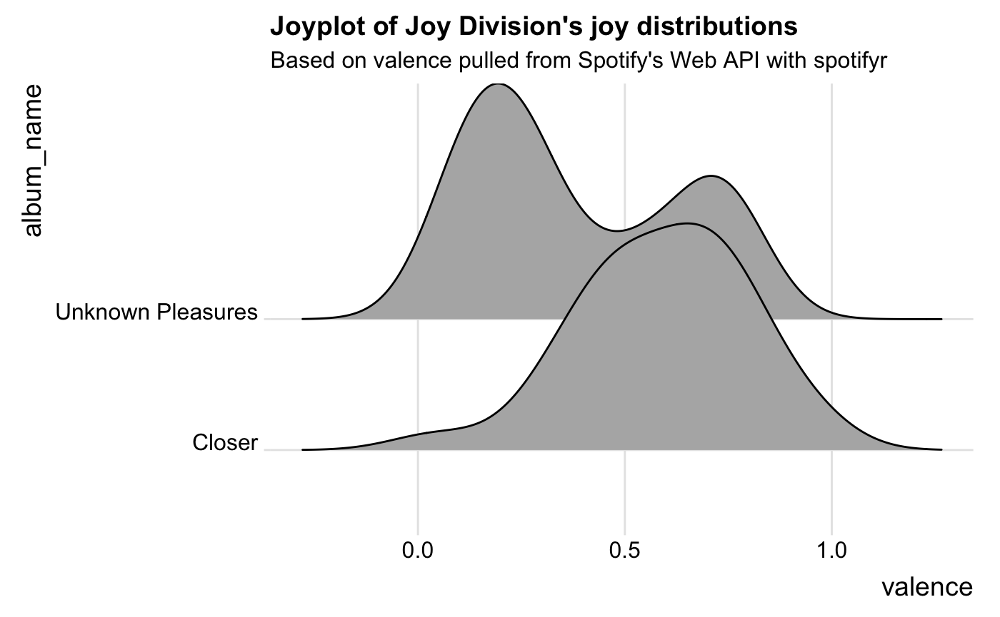

<!-- README.md is generated from README.Rmd. Please edit that file -->

# spotifyr

[](https://cran.r-project.org/package=spotifyr)


## Overview

spotifyr is an R wrapper for pulling track audio features and other
information from Spotify’s Web API in bulk. By automatically batching
API requests, it allows you to enter an artist’s name and retrieve their
entire discography in seconds, along with Spotify’s audio features and
track/album popularity metrics. You can also pull song and playlist
information for a given Spotify User (including yourself\!).

## Installation

CRAN version 2.1.0 (recommended)

``` r
install.packages('spotifyr')
```

Development version

``` r
devtools::install_github('charlie86/spotifyr')
```

## Authentication

First, set up a Dev account with Spotify to access their Web API
[here](https://developer.spotify.com/my-applications/#!/applications).
This will give you your `Client ID` and `Client Secret`. Once you have
those, you can pull your access token into R with
`get_spotify_access_token()`.

The easiest way to authenticate is to set your credentials to the System
Environment variables `SPOTIFY_CLIENT_ID` and `SPOTIFY_CLIENT_SECRET`.
The default arguments to `get_spotify_access_token()` (and all other
functions in this package) will refer to those. Alternatively, you can
set them manually and make sure to explicitly refer to your access token
in each subsequent function call.

``` r
Sys.setenv(SPOTIFY_CLIENT_ID = 'xxxxxxxxxxxxxxxxxxxxx')
Sys.setenv(SPOTIFY_CLIENT_SECRET = 'xxxxxxxxxxxxxxxxxxxxx')

access_token <- get_spotify_access_token()
```

#### Authorization code flow

For certain functions and applications, you’ll need to log in as a
Spotify user. To do this, your Spotify Developer application needs to
have a callback url. You can set this to whatever you want that will
work with your application, but a good default option is
`http://localhost:1410/` (see image below). For more information on
authorization, visit the offical [Spotify Developer
Guide](https://developer.spotify.com/documentation/general/guides/authorization-guide/).


## Usage

### What was The Beatles’ favorite key?

``` r
library(spotifyr)
beatles <- get_artist_audio_features('the beatles')
```

``` r
library(tidyverse)
library(knitr)

beatles %>% 
    count(key_mode, sort = TRUE) %>% 
    head(5) %>% 
    kable()
```

| key\_mode |  n |
| :-------- | -: |
| D major   | 24 |
| G major   | 21 |
| A major   | 13 |
| F major   | 12 |
| C major   | 11 |

### Get your most recently played tracks

``` r
library(lubridate)

get_my_recently_played(limit = 5) %>% 
    mutate(artist.name = map_chr(track.artists, function(x) x$name[1]),
           played_at = as_datetime(played_at)) %>% 
    select(track.name, artist.name, track.album.name, played_at) %>% 
    kable()
```

| track.name                                 | artist.name | track.album.name | played\_at          |
| :----------------------------------------- | :---------- | :--------------- | :------------------ |
| Hardened Chord - Regis Remix               | Stave       | After the Social | 2019-07-12 19:04:29 |
| Cells                                      | Blenk       | Shelter          | 2019-07-12 18:57:59 |
| Suspension Of Consciousness - Original mix | Flaminia    | THEOTHERSIDE 01  | 2019-07-12 18:52:32 |
| Kerala                                     | Bonobo      | Migration        | 2019-07-12 18:46:58 |
| Linked                                     | Bonobo      | Linked           | 2019-07-12 18:45:31 |

### Find your all time favorite artists

``` r
get_my_top_artists_or_tracks(type = 'artists', time_range = 'long_term', limit = 5) %>% 
    select(name, genres) %>% 
    rowwise %>% 
    mutate(genres = paste(genres, collapse = ', ')) %>% 
    ungroup %>% 
    kable()
```

| name         | genres                                                                                                                                         |
| :----------- | :--------------------------------------------------------------------------------------------------------------------------------------------- |
| Radiohead    | alternative rock, art rock, melancholia, modern rock, oxford indie, permanent wave, rock                                                       |
| Flying Lotus | alternative hip hop, escape room, experimental hip hop, glitch, glitch hop, hip hop, indietronica, intelligent dance music, jazztronica, wonky |
| Onra         | alternative hip hop, chillhop, trip hop, wonky                                                                                                 |
| Teebs        | abstract beats, bass music, chillwave, wonky                                                                                                   |
| Pixies       | alternative rock, boston rock, garage rock, indie rock, modern rock, new wave, noise pop, permanent wave, rock                                 |

### Find your favorite tracks at the moment

``` r
get_my_top_artists_or_tracks(type = 'tracks', time_range = 'short_term', limit = 5) %>% 
    mutate(artist.name = map_chr(artists, function(x) x$name[1])) %>% 
    select(name, artist.name, album.name) %>% 
    kable()
```

| name                    | artist.name | album.name |
| :---------------------- | :---------- | :--------- |
| Impossible Knots        | Thom Yorke  | ANIMA      |
| I Am a Very Rude Person | Thom Yorke  | ANIMA      |
| Traffic                 | Thom Yorke  | ANIMA      |
| Not The News            | Thom Yorke  | ANIMA      |
| Runwayaway              | Thom Yorke  | ANIMA      |

### What’s the most joyful Joy Division song?

My favorite audio feature has to be “valence,” a measure of musical
positivity.

``` r
joy <- get_artist_audio_features('joy division')
```

``` r
joy %>% 
    arrange(-valence) %>% 
    select(track_name, valence) %>% 
    head(5) %>% 
    kable()
```

| track\_name                         | valence |
| :---------------------------------- | ------: |
| Passover - 2007 Remaster            |   0.941 |
| Colony - 2007 Remaster              |   0.808 |
| Atrocity Exhibition - 2007 Remaster |   0.787 |
| A Means to an End - 2007 Remaster   |   0.752 |
| Interzone - 2007 Remaster           |   0.746 |

Now if only there was some way to plot
joy…

### Joyplot of the emotional rollercoasters that are Joy Division’s albums

``` r
library(ggjoy)

ggplot(joy, aes(x = valence, y = album_name)) + 
    geom_joy() + 
    theme_joy() +
    ggtitle("Joyplot of Joy Division's joy distributions", subtitle = "Based on valence pulled from Spotify's Web API with spotifyr")
```

<!-- -->

## Sentify: A Shiny app

This [app](http://rcharlie.net/sentify/), powered by spotifyr, allows
you to visualize the energy and valence (musical positivity) of all of
Spotify’s artists and playlists.

## Dope stuff other people have done with spotifyr

The coolest thing about making this package has definitely been seeing
all the awesome stuff other people have done with it. Here are a few
examples:

[Exploring the Spotify API with R: A tutorial for beginners, by a
beginner](https://msmith7161.github.io/what-is-speechiness/), Mia Smith

[Sentiment analysis of musical taste: a cross-European
comparison](http://paulelvers.com/post/emotionsineuropeanmusic/), Paul
Elvers

[Blue Christmas: A data-driven search for the most depressing Christmas
song](https://caitlinhudon.com/2017/12/22/blue-christmas/), Caitlin
Hudon

[KendRick
LamaR](https://davidklaing.com/blog/2017/05/07/kendrick-lamar-data-science.html),
David K. Laing

[Vilken är Kents mest deprimerande låt? (What is Kent’s most depressing
song?)](http://dataland.rbind.io/2017/11/07/vilken-%C3%A4r-kents-mest-deprimerande-lat/),
Filip Wästberg

[Чёрное зеркало Arcade Fire (Black Mirror Arcade
Fire)](http://thesociety.ru/arcadefire), TheSociety

[Sente-se triste quando ouve “Amar pelos dois”? Não é o único (Do you
feel sad when you hear “Love for both?” You’re not
alone)](http://rr.sapo.pt/especial/112355/sente-se-triste-quando-ouve-amar-pelos-dois-nao-e-o-unico),
Rui Barros, Rádio Renascença

[Using Data to Find the Angriest Death Grips
Song](https://towardsdatascience.com/angriest-death-grips-data-anger-502168c1c2f0),
Evan Oppenheimer

[Hierarchical clustering of David Bowie
records](https://twitter.com/WireMonkey/status/1009915034246565891?s=19),
Alyssa Goldberg

[tayloR](https://medium.com/@simranvatsa5/taylor-f656e2a09cc3), Simran
Vatsa

[Long Distance Calling: Data Science meets
Post-Rock…](https://sebastiankuhn.wordpress.com/2017/11/08/r-spotify-part-1-long-distance-calling/),
Sebastian Kuhn
