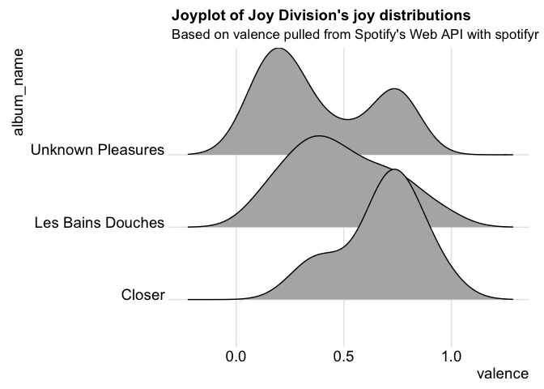

<!-- README.md is generated from README.Rmd. Please edit that file -->
spotifyr
========

[](https://cran.r-project.org/package=spotifyr) 

Overview
--------

spotifyr is a wrapper for pulling track audio features and other information from Spotify's Web API in bulk. By automatically batching API requests, it allows you to enter an artist's name and retrieve their entire discography in seconds, along with Spotify's audio features and track/album popularity metrics. You can also pull song and playlist information for a given Spotify User (including yourself!).

Installation
------------

Development version (recommended)

``` r
devtools::install_github('charlie86/spotifyr')
```

The development version now imports the `geniusR` package from [Josiah Parry](https://github.com/JosiahParry/geniusR), which you can install with:

``` r
devtools::install_github('JosiahParry/geniusR')
```

(Note that this is separate from the `geniusr` package currently on CRAN)

CRAN version 1.0.0 (Note: this is somewhat outdated, as it takes extra time to submit and pass CRAN checks)

``` r
install.packages('spotifyr')
```

Authenication
-------------

First, set up a Dev account with Spotify to access their Web API [here](https://developer.spotify.com/my-applications/#!/applications). This will give you your `Client ID` and `Client Secret`. Once you have those, you can pull your access token into R with `get_spotify_access_token`.

The easiest way to authenticate is to set your credentials to the System Environment variables `SPOTIFY_CLIENT_ID` and `SPOTIFY_CLIENT_SECRET`. The default arguments to `get_spotify_access_token` (and all other functions in this package) will refer to those. Alternatively, you can set them manually and make sure to explicitly refer to your access token in each subsequent function call.

``` r
Sys.setenv(SPOTIFY_CLIENT_ID = 'xxxxxxxxxxxxxxxxxxxxx')
Sys.setenv(SPOTIFY_CLIENT_SECRET = 'xxxxxxxxxxxxxxxxxxxxx')

access_token <- get_spotify_access_token()
```

Usage
-----

### What was The Beatles' favorite key?

``` r
library(spotifyr)
```

``` r
beatles <- get_artist_audio_features('the beatles')

library(tidyverse)
count(beatles, key_mode, sort = T)
#> # A tibble: 22 x 2
#>    key_mode     n
#>    <chr>    <int>
#>  1 C major     46
#>  2 D major     41
#>  3 G major     38
#>  4 A major     36
#>  5 E major     21
#>  6 F major     18
#>  7 A minor     11
#>  8 B minor     10
#>  9 E minor     10
#> 10 C# minor     9
#> # ... with 12 more rows
```

### What's the most joyful Joy Division song?

My favorite audio feature has to be "valence," a measure of musical positivity.

``` r
joy <- get_artist_audio_features('joy division')

joy %>% 
 arrange(-valence) %>% 
 select(track_name, valence) %>% 
 head(10)
#> # A tibble: 10 x 2
#>    track_name                                    valence
#>    <chr>                                           <dbl>
#>  1 These Days                                      0.949
#>  2 Passover - 2007 Remastered Version              0.941
#>  3 Colony - 2007 Remastered Version                0.808
#>  4 Atrocity Exhibition - 2007 Remastered Version   0.787
#>  5 Wilderness                                      0.775
#>  6 Twenty Four Hours                               0.773
#>  7 A Means To An End - 2007 Remastered Version     0.752
#>  8 Interzone - 2007 Remastered Version             0.746
#>  9 She's Lost Control - 2007 Remastered Version    0.743
#> 10 Disorder - 2007 Remastered Version              0.740
```

Now if only there was some way to plot joy...

### Joyplot of the emotional rollercoasters that are Joy Division's albums

``` r
library(ggjoy)
#> Loading required package: ggridges
#> The ggjoy package has been deprecated. Please switch over to the
#> ggridges package, which provides the same functionality. Porting
#> guidelines can be found here:
#> https://github.com/clauswilke/ggjoy/blob/master/README.md

ggplot(joy, aes(x = valence, y = album_name)) + 
  geom_joy() + 
  theme_joy() +
  ggtitle("Joyplot of Joy Division's joy distributions", subtitle = paste0("Based on valence pulled from Spotify's Web API with spotifyr"))
#> Picking joint bandwidth of 0.112
```


### Danceability of Thom Yorke albums

    #> Linking to ImageMagick 6.9.9.39
    #> Enabled features: cairo, fontconfig, freetype, lcms, pango, rsvg, webp
    #> Disabled features: fftw, ghostscript, x11
    #> 
    #> Attaching package: 'lubridate'
    #> The following object is masked from 'package:base':
    #> 
    #>     date
    #> Picking joint bandwidth of 0.0714
    #> Picking joint bandwidth of 0.0714



``` r
background <- image_read('img/danceplot.png')
logo_raw <- image_read('img/thom_dance.gif')
frames <- lapply(1:length(logo_raw), function(frame) {
    hjust <- 200+(100*frame)
    image_composite(background, logo_raw[frame], offset = str_glue('+{hjust}+400'))
})

image_animate(image_join(frames), fps = 5, loop = 0)
```


Sentify: A Shiny app
--------------------

This [app](http://rcharlie.net/sentify/), powered by spotifyr, allows you to visualize the energy and valence (musical positivity) of all of Spotify's artists and playlists.

Dope stuff other people have done with spotifyr
-----------------------------------------------

The coolest thing about making this package has definitely been seeing all the awesome stuff other people have done with it. Here are a few examples:

[Sentiment analysis of musical taste: a cross-European comparison](http://paulelvers.com/post/emotionsineuropeanmusic/) - Paul Elvers

[Blue Christmas: A data-driven search for the most depressing Christmas song](https://caitlinhudon.com/2017/12/22/blue-christmas/) - Caitlin Hudon

[KendRick LamaR](https://davidklaing.github.io/kendrick-lamar-data-science/) - David K. Laing

[Vilken är Kents mest deprimerande låt? (What is Kent's most depressing song?)](http://dataland.rbind.io/2017/11/07/vilken-%C3%A4r-kents-mest-deprimerande-lat/) - Filip Wästberg

[Чёрное зеркало Arcade Fire (Black Mirror Arcade Fire)](http://thesociety.ru/arcadefire) - TheSociety

[Sente-se triste quando ouve "Amar pelos dois"? Não é o único (Do you feel sad when you hear "Love for both?" You're not alone)](http://rr.sapo.pt/especial/112355/sente-se-triste-quando-ouve-amar-pelos-dois-nao-e-o-unico) - Rui Barros, Renascença
